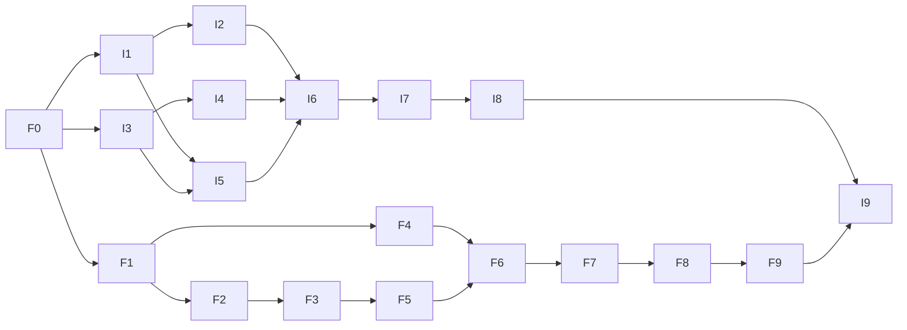

# Implementation Plan: Extensible BLE live signals

Status: issue breakdown requested by the owner on 2026-10-06. This plan
records scoped future work; no production implementation has started.

Tasks are tracked in GitHub Issues in `Yuke-hd/mazda-can-accessory-controller`
and `Yuke-hd/esp-can-companion`. The Task List below is an index, not a second
completion checklist. The IDs below are stable plan aliases used by the
dependency graph; each links to its published issue.

Firmware tracker: [#195](https://github.com/Yuke-hd/mazda-can-accessory-controller/issues/195).

iOS tracker: [#41](https://github.com/Yuke-hd/esp-can-companion/issues/41).

## Objective and baseline

Use the [planning spec](../docs/specs/companion/extensible-live-signals.md)
to add discovery and length-delimited records while keeping legacy telemetry
available. The owner confirmed coexistence and automatic display of new signals.

Current firmware implements fixed layout 2 (21 signals, 28 bytes), and the
iOS checkout supports layouts 1 and 2. Firmware #189 and iOS #32/#34 track
the independently owned fixed-layout acceleration work. This initiative
preserves that work and does not supersede, close or rewrite those tickets. The shared
contract issue finalizes wire details and resolves draft Open Questions before
implementation. Production iOS work is explicitly part of this initiative,
tracked in the separate app repository.

## Architecture decisions

- Add catalog 0006 and extensible Notify 0007 to protocol 1.1; preserve 0004.
- Derive supported readable signals/choices from the generic provider catalog.
  Semantic keys are persistent identities; discovered handles are temporary.
- Independently parse records and skip length-delimited unknown extensions;
  bound catalog, buffers, work and per-signal state.
- Preserve provider availability and the brake-only safety exception. Client
  per-signal expiration must prevent other traffic retaining an obsolete Fresh
  display. Packet arrival does not establish freshness.
- Keep wire parsing in CompanionProtocol and CoreBluetooth operations in
  BLETransport. Add explicit notification control: current pairing code
  automatically enables legacy-live CCCDs and must allow negotiated selection.
- Project semantic readings into existing curated dashboards, then expose
  every discovered signal through a generic read-only list.
- Freeze shared synthetic vectors before parallel firmware/iOS codec work;
  consume copies with an explicit source/version, without a new runtime package.

## Task List

### Shared contract

- [F0 — #196](https://github.com/Yuke-hd/mazda-can-accessory-controller/issues/196): finalize and publish contract, limits, token maps and synthetic vectors.

### Firmware lane

- [F1 — #197](https://github.com/Yuke-hd/mazda-can-accessory-controller/issues/197): bounded generic catalog export and page encoding (after F0).
- [F2 — #198](https://github.com/Yuke-hd/mazda-can-accessory-controller/issues/198): typed record encoding and provider read outcomes (after F1).
- [F3 — #199](https://github.com/Yuke-hd/mazda-can-accessory-controller/issues/199): fair portable pacing and retry/heartbeat state (after F2).
- [F4 — #200](https://github.com/Yuke-hd/mazda-can-accessory-controller/issues/200): protected stable catalog page handler (after F1).
- [F5 — #201](https://github.com/Yuke-hd/mazda-can-accessory-controller/issues/201): NimBLE extensible notifier binding (after F3).
- [F6 — #202](https://github.com/Yuke-hd/mazda-can-accessory-controller/issues/202): additive endpoint/service registration and CCCD accounting (after F4/F5).
- [F7 — #203](https://github.com/Yuke-hd/mazda-can-accessory-controller/issues/203): advertise usable capability in additive Device info (after F6).
- [F8 — #204](https://github.com/Yuke-hd/mazda-can-accessory-controller/issues/204): new module boundary/header probes and ownership contracts (after F7).
- [F9 — #205](https://github.com/Yuke-hd/mazda-can-accessory-controller/issues/205): provider-to-reference-consumer integration and resource evidence (after F8).

### iOS lane

- [I1 — #42](https://github.com/Yuke-hd/esp-can-companion/issues/42): bounded catalog and extension metadata codecs (after F0).
- [I2 — #43](https://github.com/Yuke-hd/esp-can-companion/issues/43): typed records and independent liveness state (after I1).
- [I3 — #44](https://github.com/Yuke-hd/esp-can-companion/issues/44): optional characteristic transport routing (after F0).
- [I4 — #45](https://github.com/Yuke-hd/esp-can-companion/issues/45): explicit real/fake selected-notifier control (after I3).
- [I5 — #46](https://github.com/Yuke-hd/esp-can-companion/issues/46): bounded connection-scoped catalog discovery (after I1/I3).
- [I6 — #47](https://github.com/Yuke-hd/esp-can-companion/issues/47): extensible/legacy negotiation and generic snapshots (after I2/I4/I5).
- [I7 — #48](https://github.com/Yuke-hd/esp-can-companion/issues/48): semantic-key projection into current curated readouts (after I6).
- [I8 — #49](https://github.com/Yuke-hd/esp-can-companion/issues/49): automatically populated generic signal list (after I7).
- [I9 — #50](https://github.com/Yuke-hd/esp-can-companion/issues/50): fake/demo journeys and cross-repository compatibility evidence
  (after I6/I8/F9).

## Dependency graph

## Parallelism and ownership

Only F0 is initially unblocked. After its contract is stable, firmware F1
and iOS I1/I3 can proceed independently. F4 can proceed alongside F2/F3;
iOS I4 can proceed alongside I1/I2, and I5 follows the catalog/transport
interfaces. Do not implement consumers against an unstable dependency.

Each task owns the files listed in its issue. Existing CMake registration,
CompanionClient, and ConnectionManagerTransport edits overlap: coordinate
PR sequencing and rebases or have one owner integrate each shared file.
Do not assign two workers to mutate the same file concurrently. Prefer one
small PR per issue. Core codec/binding slices do not require all app features
to be present to remain buildable.

## Verification checkpoints

- [ ] Contract: owner reviews published tables/corner cases, complete unit and
  evidence tokens, unknown-type policy, empty-catalog behavior and vectors.
- [ ] Portable path (F1/F2, I1/I2): exact shared bytes, conservative bounds,
  status outcomes and fixed-layout golden regressions pass.
- [ ] Streaming/service (F3/F4/F5): MTU64/247 fairness, retry/latest state,
  security gates, stable catalog pages and legacy pacing are verified in
  software; physical ATT/radio checks are explicitly deferred.
- [ ] Client/service integration (F7, I6): complete discovery, one selected
  stream, legacy1/2 fallback, reconnect/token invalidation and cancellation
  work without config regressions.
- [ ] Feature (F9/I9): fresh host tests/structural/sanitizer gates, firmware
  compilation/size, package/app tests and rendered synthetic app journeys
  show a new signal/choice without format/decoder edits.
- [ ] Physical release: owner explicitly scopes bench/phone work and verifies
  actual board/port/power/wiring/fuse. Existing firmware bench issue
  https://github.com/Yuke-hd/mazda-can-accessory-controller/issues/167 is
  related; record additional extension-specific Service Changed, restored
  CCCD, bond, rate, high-water and CAN/LED coexistence evidence separately.
  This planning request does not authorize flashing or vehicle connection.

## Risks and mitigations

| Risk | Impact | Mitigation |
| --- | --- | --- |
| Existing app/layout2 work overlooked | Regression or duplicate G-meter work | Preserve negotiated legacy layouts and link existing tickets. |
| Current radio automatically enables legacy telemetry | Accidental dual streams | Explicit CCCD control before negotiation; keep Config status separate. |
| Handle/token reused after reboot | Wrong semantic values | Complete rediscovery on every connection; connection-generation guards. |
| Small MTU and frequent changes starve quieter signals | Obsolete or missing displays | Rotating fairness, bounded refresh and independent client expiration. |
| Metadata unknowns or malformed packets elevate confidence | Incorrect Fresh display | Strict transactional parsing and conservative status/unit/evidence handling. |
| GATT capacity/CCCD/host stack costs | BLE or real-time regression | Additive capacity review, resource evidence and separate physical release gate. |
| Duplicated schema mappings across repositories | C++/Swift drift | Reviewed shared vectors plus version/provenance and cross-repo integration tests. |

## Validation of this plan

Issue drafts have three grouped acceptance criteria, explicit verification,
non-goals, identified dependencies, and at most five expected files each.
The draft manifest was checked for duplicate IDs, missing dependencies and
cycles. No prior `tasks/plan.md` or task checklist existed to overwrite.
All 21 published issues were verified remotely: coding-bot author, expected
repository/title/body, open state, complete parent/dependency URLs, and no
unresolved placeholders. All 19 child tasks have three acceptance criteria.
Existing G-meter and bench issues were not modified.

## Open decisions

Resolve detailed wire mappings/corner cases in F0 before implementation.
The physical bench/phone checkpoint requires a later explicitly scoped session.
No dependency pin, legacy retirement, new runtime library or G-meter feature
is authorized by this plan. Owner review of the plan/issues precedes build work.
